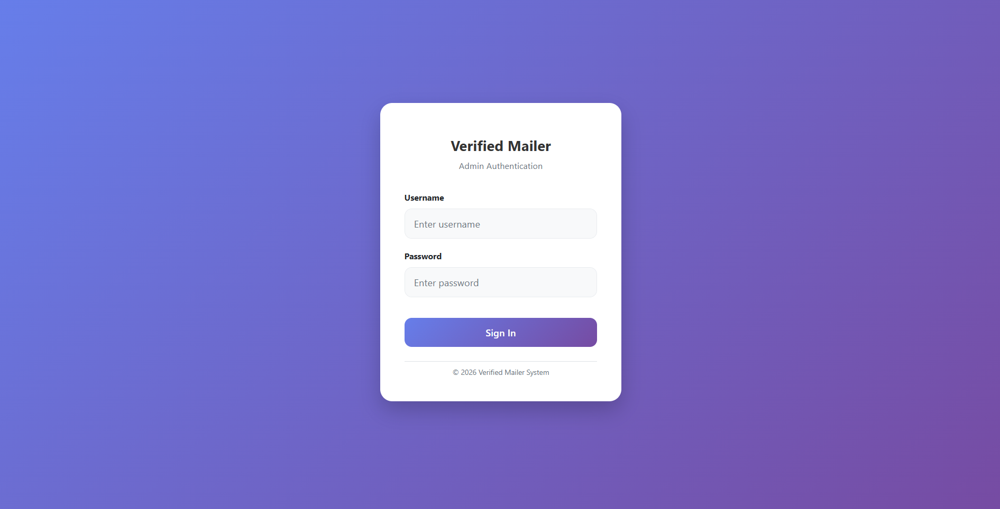
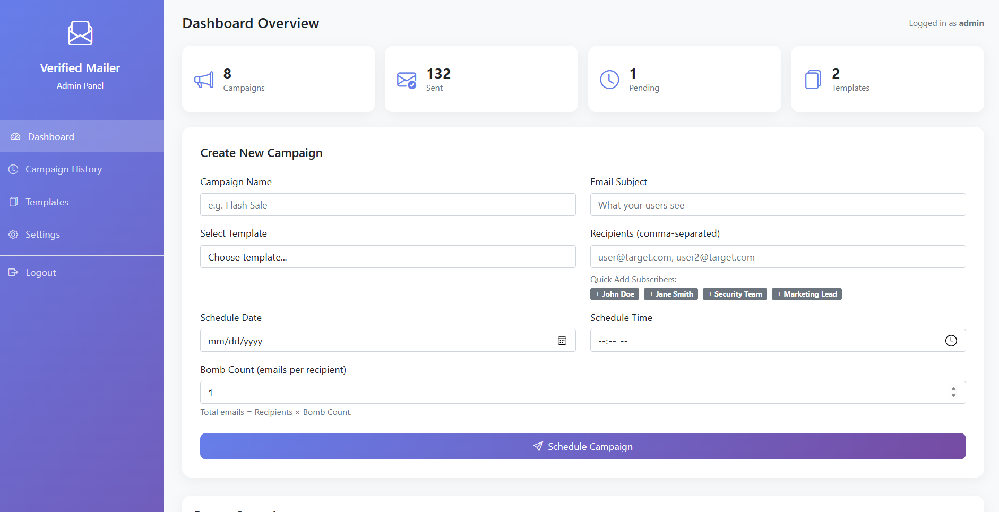
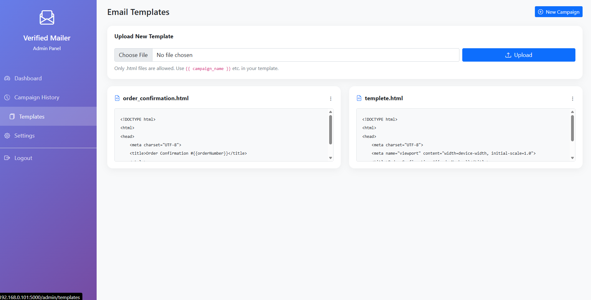
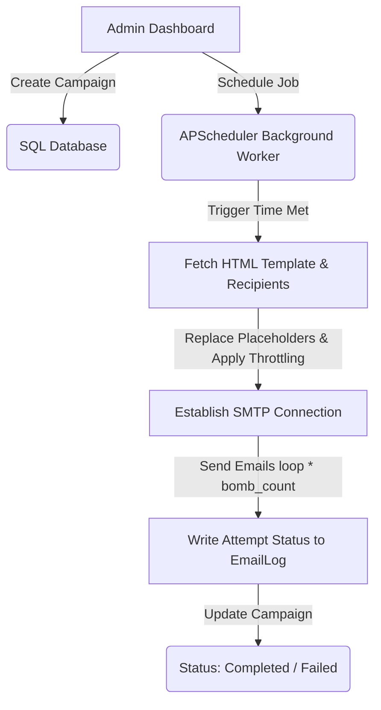

# Mail Bomb - Scheduled Email Campaign Dashboard

Mail Bomb is a secure, Flask-based administrative dashboard designed for creating, scheduling, and managing targeted email campaigns. It provides a web interface to configure SMTP services, manage subscribers, import templates, and schedule high-volume or single-send email campaigns (with a custom "bomb count" for sending multiple emails to specific targets).

---

## Table of Contents
- [Description](#description)
- [Screenshots / Demo](#screenshots--demo)
- [Features](#features)
- [Tech Stack](#tech-stack)
- [Project Architecture](#project-architecture)
- [Installation](#installation)
- [Configuration](#configuration)
- [Usage](#usage)
- [Folder Structure](#folder-structure)
- [Security Features](#security-features)
- [Testing](#testing)
- [Future Improvements](#future-improvements)

---

## Description
This project enables system administrators to manage and automate email dispatch workflows. Key functionalities include loading custom HTML layouts, mapping dynamic placeholders (like order numbers, dates, and recipient names), and scheduling sends using a persistent task queue. The project includes administrative security features such as configurable session timeouts, login alerts, and request sanitization.

---

## Screenshots / Demo
*(Note: To generate screenshots, run the web application locally, capture images, and save them in a `docs/screenshots/` folder. Update the references below as needed.)*

1. **Admin Login Page**
    *(Placeholder)*
2. **Dashboard Overview**
    *(Placeholder)*
3. **Settings and Configuration**
    *(Placeholder)*

---

## Features
- **User Authentication**: Secure admin login system powered by `Flask-Login` and password hashing.
- **Campaign Scheduler**: Asynchronous email delivery scheduling using `APScheduler`. Campaigns can run instantly or be scheduled for a precise date and time.
- **Configurable "Bomb Count"**: Option to define a repetition multiplier (`bomb_count`) per campaign, sending multiple copies of an email to each recipient (useful for high-priority notification spamming, load testing, or urgent warning broadcasts).
- **Dynamic SMTP Configuration**: Direct management of SMTP host, port, credentials, and TLS settings from the settings panel.
- **HTML Template Engine**: Custom HTML email template uploads with runtime placeholder substitution (e.g., `{{customerName}}`, `{{orderNumber}}`, `{{orderDate}}`, `{{company}}`, `{{year}}`).
- **Subscriber Directory**: Integrated management tool to subscribe, track, or delete active email addresses.
- **Real-Time Logs & Analytics**: Detailed audit trail (`EmailLog`) showing success/failure statuses and exception traces for every single email sent.
- **Throttling Protection**: Configurable rate limit delay between email sends to prevent SMTP server throttling.

---

## Tech Stack
- **Backend Framework**: [Flask](https://flask.palletsprojects.com/) (Python 3.x)
- **Database ORM**: [Flask-SQLAlchemy](https://flask-sqlalchemy.palletsprojects.com/) (SQLite backend)
- **Task Scheduler**: [APScheduler](https://apscheduler.readthedocs.io/) (Background scheduler)
- **Security & Session Management**: [Flask-Login](https://flask-login.readthedocs.io/), [Werkzeug Security](https://werkzeug.palletsprojects.com/)
- **Frontend Framework**: [Bootstrap 5](https://getbootstrap.com/), Vanilla CSS3, Google Fonts
- **Templating Engine**: [Jinja2](https://jinja.palletsprojects.com/)

---

## Project Architecture
The project is built on a lightweight Model-View-Controller (MVC) design pattern using Flask:
- **Models** (`SQLAlchemy`): Defined in [app.py](file:///a:/backup/mail%20bomb/app.py), including `User`, `Campaign`, `EmailLog`, `Subscriber`, and `Setting` models.
- **Views** (`Jinja2` Templates): Stored in the [templates/](file:///a:/backup/mail%20bomb/templates/) directory, rendering HTML pages styled with Bootstrap 5.
- **Controllers / Routing**: [app.py](file:///a:/backup/mail%20bomb/app.py) handles HTTP requests, handles campaign logic, manages SMTP sessions, and schedules worker threads.

### Email Scheduling & Execution Flow


---

## Installation

### Prerequisites
- Python 3.8 or higher installed on your system.

### Steps
1. **Clone or Extract the Project Directory**
   Navigate to the project root:
   ```bash
   cd "mail bomb"
   ```

2. **Set Up a Virtual Environment (Recommended)**
   ```bash
   python -m venv venv
   # On Windows:
   .\venv\Scripts\activate
   # On macOS/Linux:
   source venv/bin/activate
   ```

3. **Install Dependencies**
   ```bash
   pip install -r requirement.txt
   ```

4. **Initialize the Database & Create Default Admin**
   Running the app for the first time automatically initializes the SQLite database (`campaigns.db`) and creates a default admin user. 
   
   If you need to manually reset the admin password to a known default (`admin123`), run:
   ```bash
   python reset_pwd.py
   ```

5. **Run the Application**
   ```bash
   python app.py
   ```
   The application will be accessible locally at `http://127.0.0.1:5000/`.

---

## Configuration

The application can be configured using environment variables or directly inside the administrative settings panel.

### Environment Variables
Create a `.env` file in the root directory to define settings:
```ini
SECRET_KEY=your_super_secret_session_key
DATABASE_URL=sqlite:///campaigns.db
ADMIN_PASSWORD=custom_admin_password
SMTP_SERVER=smtp.gmail.com
SMTP_PORT=587
SMTP_USERNAME=your_email@gmail.com
SMTP_PASSWORD=your_app_password
SMTP_USE_TLS=true
```

---

## Usage

1. **Accessing the Dashboard**: Navigating to `http://127.0.0.1:5000` will redirect you to the login screen. Log in using `admin` and your password.
2. **Settings Configuration**: Go to the **Settings** page and verify your SMTP credential setup. Here, you can also define the application name, default session timeouts, default bomb count, and email throttling delays (in seconds).
3. **Subscribers Management**: Under the **Subscribers** tab, you can populate active recipients to make them selectable on campaign creations.
4. **Email Layouts**: Place template HTML files in the `send_templates` directory, or upload them using the template upload dashboard. Use standard tags like `{{customerName}}` to personalize content.
5. **Running a Campaign**:
   - Navigate to the Dashboard.
   - Choose a campaign name, subject line, template, and recipient list (comma-separated).
   - Input the **Bomb Count** (e.g., `5` to send each recipient 5 emails).
   - Select the target execution Date and Time.
   - Click **Schedule Campaign**.
6. **Monitoring**: Track delivery progress and view SMTP success/error responses on the **Campaign History** page.

---

## Folder Structure
```text
mail bomb/
│
├── app.py                 # Core Flask application, models, routes, and scheduler logic
├── campaigns.db           # SQLite Database (auto-generated)
├── requirement.txt        # Python dependency manifest
├── reset_pwd.py           # CLI script to reset 'admin' password to 'admin123'
│
├── instance/              # SQLite instance location (if configured)
│
├── send_templates/        # Uploaded HTML email layout templates
│   ├── order_confirmation.html
│   └── templete.html
│
├── static/                # Static assets
│   └── style.css          # Custom styling and scrollbar styles
│
└── templates/             # Jinja2 HTML views for the admin dashboard
    ├── admin_dashboard.html
    ├── campaign_details.html
    ├── campaign_history.html
    ├── login.html
    ├── settings.html
    ├── subscribers.html
    └── templates.html
```

---

## Security Features
- **Sensitive Data Isolation**: Credentials and secrets can be controlled using OS environment variables.
- **Password Protection**: Account passwords are encoded using salted hashes (`werkzeug.security`) rather than plain-text.
- **XSS Mitigation**: The custom `sanitize_input` filter runs on fields (like campaign names and subject lines) to encode potential HTML payloads, avoiding Cross-Site Scripting (XSS) in views.
- **Custom Session Timeouts**: Admin sessions automatically expire after a configurable timeframe (defaults to 30 minutes), limiting unauthorized physical access exposure.
- **Intrusion Alerts**: Optional settings to trigger a security alert email to the admin's email address upon every successful admin authentication.
- **SQL Injection Prevention**: SQLAlchemy's query building handles parameterization natively, eliminating SQL injection vectors.

---

## Testing

Currently, testing can be performed manually:
1. **Local SMTP Mocking**: Configure the system SMTP server to `127.0.0.1` on port `1025` and use mock servers like [Mailpit](https://github.com/axllent/mailpit) or [Mailtrap](https://mailtrap.io/) to capture sent emails without sending real messages.
2. **Password Script Verification**: Run `python reset_pwd.py` to confirm database connectivity and credential update actions.
3. **Database Integrity**: Access and view `campaigns.db` using a SQLite database inspector (e.g., DB Browser for SQLite) to verify tables (`user`, `campaign`, `email_log`, `subscriber`, `setting`) are written properly.

---

## Future Improvements
- Add automated unit and integration tests using `pytest` and `Flask-Testing`.
- Integrate a rich visual WYSIWYG editor (like Quill or TinyMCE) directly into the Template page to compose HTML emails online.
- Support CSV and Excel file uploads for importing batch recipients or subscribers.
- Transition from basic SMTP username/password to OAuth2 authorization for providers like Google Workspace and Microsoft 365.
- Implement multi-user support with custom role permissions (e.g., viewers, schedulers, and administrators).
- Support tracking of open rates and click rates using transparent tracking pixels.
